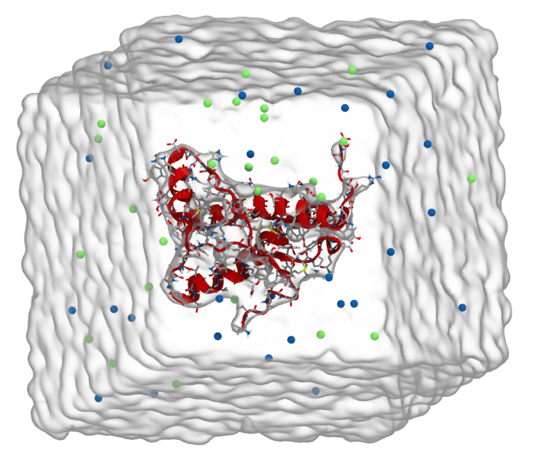

# Protein Simulations

_This tutorial is based upon the adaptation of [Justin Lemkuhl tutorial](http://www.mdtutorials.com/gmx/lysozyme/index.html) (Living J. Comp. Mol. Sci. 2018, 1, 5068) by [Alessandra Villa](https://tutorials.gromacs.org/docs/md-intro-tutorial.html)._

In this practical session, we will learn the basics of Molecular Dynamics (MD) simulations with GROMACS, and use of assisting software (e.g., VMD, xmgrace, gedit) to visualise and manipulate the data.

GROMACS was originally conceived for protein simulations, and this is also where we will begin. There are many more tutorials for GROMACS some can be found on: [www.mdtutorials.com/gmx](http://www.mdtutorials.com/gmx/).

GROMACS is short for (GROningen MAchine for Chemical Simulations). It consists of a suite of programs for MD simulations. It was originally developed in the University of Groningen, but now is maintained and extended at different places, including the University of Uppsala, University of Stockholm and the Max Planck Institute for Polymer Research. GROMACS is open source software, released under the GPL (general public license), and is free to use.

GROMACS own manual says about itself:

> GROMACS is a versatile package to perform molecular dynamics, i.e. simulate the Newtonian equations of motion for systems with hundreds to millions of particles.
> 
> It is primarily designed for biochemical molecules like proteins, lipids and nucleic acids that have a lot of complicated bonded interactions, but since GROMACS is extremely fast at calculating the nonbonded interactions (that usually dominate simulations) many groups are also using it for research on non-biological systems, e.g. polymers.

For everyday general molecular simulations, GROMACS is one of the fastest MD programs. It is also quite flexible, so apart of proteins and biomolecules in general, it can be used to simulate a vast range of different types of molecules. If you want to use it on your own machine, you can download GROMACS from [manual.gromacs.org](https://manual.gromacs.org) or on Linux use `apt-get install gromacs`  and on Mac via homebrew  `brew install gromacs`.  

GROMACS is commonly available on high performance computers, including the University's Eddie HPC, and also Tier 2 and Tier 1 (national supercomputers) such as Cirrus or  Archer.

## SIMULATIONS

Every simulation needs to start with a structure. Even though a lot of computational efforts have been done, it is still not possible to computationally predict tertiary structure of the protein from its primary one, i.e. its amino acid sequence. This would require inaccessible computational powers and times. 

For this reason, normally a 3D structure predicted from X-ray diffraction is used as a starting point. Here, we will be downloading a protein structure from Protein Data Dank (PDB) [www.rcsb.org/pdb](https://www.rcsb.org/pdb/)

> A quick word of warning is appropriate. Experiment is sometimes not perfect. So it is possible for crystal structures in the PDB database to have a few errors within them. These “errors” are usually caused by experiment being unable to clearly “see” amino acid side-chains within the protein crystal because of its molecular motion. In some cases, it is necessary to “clean up” a protein structure before using it in a simulation study. Good programs for doing this include, coot http://www.biop.ox.ac.uk/coot/ and the Swiss-PdbViewer (DeepView) http://spdbv.vital-it.ch/

The structures in the PDB are stored by a codename. Here is a selection of structures that do not require any further cleaning, so make a pick for a structure to work with: 

* Prion - **1qlz** (human), **1xyw** (elk), **1u3m** (chicken) and **1xu0** (clawed frog)
* Hen egg-white lysozyme – **1aki**
* Spider toxin – **1omb**
* Ubiquin – **1ubq**

Figure 1 below shows a typical protocol for the simulation of protein in the box. In this tutorial, we will follow this same protocol.

Figure 1: Typical flowchart of a simulation of protein in water, often a number of simulations have to be performed to prepare the system for a production MD run, the interactive flowchart can be found at [manual.gromacs.org](https://manual.gromacs.org/current/user-guide/flow.html)

## TUTORIAL 

### 1) Make a directory to work in and download the structure

Make a directory named **practical**

	mkdir practical

Download the protein structure file you have chosen, here example is **1xyz.pdb** 

	wget http://www.rcsb.org/pdb/files/1xyw.pdb  .

(you can also manually download the pdb file from the web)

Move the file in into the directory:
	
	mv 1xyw.pdb ./practical

Go into the directory:

	cd practical/

Read through the file:

	more 1xyw.pdb

- REMARK lines are comments.

- ATOM lines contain atom coordinates

- CONNECT lines contain connection information. (Note however there is little information available on bonding in the file – bonds can be inferred from atomic positions by the programs below).

To scroll down use `space` bar, to exit the viewer press `Ctrl+C`.

### 2) Visualise the structure

There are many programs to view the structure, within this practical we will be using [VMD](https://www.ks.uiuc.edu/Research/vmd/), that works smoothly with GROMACS output.

	vmd 1xyw.pdb

play around with it, try to rotate/zoom. It is also possible to change the way the molecule is viewed by:

	Graphics >  Representation

Choose in the drop down menu `Drawing Method` the `New Cartoon` representation, that only shows the backbone of the protein. Try other options and see for yourself.

VMD is an extremely versatile program, not only allowing to visualise a system and produce beautiful images and videos, but also to carry out complex analysis with TCL scripts. It is also free and can run on Linux, Mac and Windows.

### 3) Organisation of your work

As we start to work on the tutorial, a lot of files will be generated. Old files with the same name as newly generated ones will be overwritten (GROMACS backs up old files in the format of `#filename.extention.1#`) To be able to retrieve the data later, you have to keep your work organised, naming files coherently. Personally, I advise to run each simulation step in a different sub-directory or to make input and output files in a manner that you will be able to identify after.

	cp 1xyw.pdb protein.pdb

> As mentioned before, it is quite common to have missing residues and missing atoms in a protein structure. These need to be repaired before any molecular dynamics can take place. In this tutorial, the protein examples have deliberately been chosen to be free from any of these errors. However, one of the biggest tasks for a biological simulator in practice is to prepare and check structures prior to simulation.
> 
> Non-standard groups are the other common issue in MD simulations. These could consist of non-standard residues, modified residues or ligands, for which force field parameters are not yet available. Considerable work is often required to either eliminate these groups, modify them, or determine missing force field parameters by reference to the literature and/or use of quantum chemical calculations. The structures in this tutorial only consist of natural amino acids, for which quite reasonable force field parameters exist for use with GROMACS.
> 
> In general, it is also good to run checks on a protein structure to make sure that the refinement process in crystal structure determination has:
> 
> - given proper orientations of glutamine and asparagine amide groups;
> - that the protonation state and side chain orientation of histidine residues are consistent;
> - no other problems exist with the system. 
> 
> A number of tools have been developed specifically for this purpose but we will be assuming for this practical that the structures given by the X-ray are OK.
 

### 4) Creating topology

Since MD simulations rely on force fields to describe the interactions of atoms, having an atomic structure is not enough. We need to assign a topology (i.e. a description of the atoms’ covalent network). Connectivity information is necessary in order to calculate inter-atomic interactions as described in the force field used to your simulation. GROMACS comes with a good set of force fields and a program, `pdb2gmx`, to assign those (only works on perfect proteins). Note, since GROMACS version 5.X, all commands come with a prefix `gmx` or `gmx_mpi` (when compiled to run parallel):

As all GROMACS commands come with a help menu that can be called with `–h`

	gmx pdb2gmx -h

have a look through the help manual. GROMACS programs ask for a set of inputs and will provide a set of outputs, if those are named by default name there is no need to specify their input/output name. For this practical call the command:

	gmx pdb2gmx -f protein.pdb -o protein.gro -p protein.top -ignh 

*What does each variable stand for?*

You need to advise the program on the choice of force fields. Lets use CHARMM force field (type in `8` and press `enter`) and then the when the program asks which water model to use -- chose SPC (`5` + `enter`).

Again, check what files have been generated with `ls –lrth`

*What files were generated? What information do they contain?*

Look through them with `more` or `gedit` tools.

a) **protein.gro** - this file contains the protein coordinates in GROMACS format. Note that the file contains information about the protein amino acid residue (e.g. LEU and GLY etc.) and also the atom name inside the residue. The atom name links to the force field files.

b) **protein.top** – this file contains information about the topology of your system. It includes the information on each molecules, here protein, linking associated force fields used to calculate interactions between atoms (either explicitly stated, or referenced from another file). 

Near the top of the file, you will see a line, which reads:

	#include "charmm27.ff/forcefield.itp"

this line will link your GROMACS simulation to this force field directory (`charmm27.ff`), which contains individual spring constants etc. for the force field. As you scroll down (press space bar) the topology file, you will see entries for atoms, their names, charges, declaration of bonds, angles, dihedrals between atoms, etc. To exit the `more` view, press `Ctrl+C`.

The topology file can also link include topology tiles:

	#include "charmm27.ff/spc.itp"

These contain all the topology information for components of the system, here the example is for the SPC water molecule, which is within the CHARMM force field directory.

Towards the bottom of the file, under section `[ molecules ]` you will find the system composition. Keep an eye how it changes as we solvate the system and add ions. You can do it with the `tail` command:

	tail -10 protein.top

showing the last 10 lines of the file, currently only reading:
	
	[ molecules ]
	; Compound        #mols
	Protein_chain_A     1

c) **posre.itp** - is another include topology file, but here it contains position restraints for all the heavy atoms in your original pdb file (more about these later – we will use them to restrain the protein during some initial MD simulation steps).

### 5) Creating a simulation box around protein

Add a box around the protein with periodic boundary conditions. This can be done with `editconf`

	gmx editconf -f protein.gro -o protein-pbc.gro -bt dodecahedron -d 1.0 -c

*What do the above options mean?*

The box does not have to be cubic to be periodic (think of honeycombs). For spherical proteins, an obvious choice might be a rhombic dodecahedron as periodic box, because it corresponds closely to a spherical shape (but unlike a sphere – does fill space!). To stop direct interactions between periodic protein images, we will set a minimal distance of 1.0 nm between the protein and the wall of the box, i.e. no two neighbour proteins in adjacent boxes will be not closer than 2.0 nm.

Use the Linux command tail to see the end of the new file, where the box is defined.

GROMACS uses a triclinic matrix representation, with the first three numbers specifying the diagonal elements (xx, yy, zz) and the last six giving the off-diagonal elements (xy, xz, yx, yz, zx, zy).

Visualise the resulting protein in a box with `vmd`.

	vmd protein-pbc.gro

It is possible to also visualise the box by typing `pbc box `into the terminal/console window, after `vmd >`

### 6) Minimisation run

Now we can perform an energy minimisation simulation. 
For this you will need an .mdp (MD Parameter) file, that tells the MD engine what to do.

These mdp files are stored in the directory `Session2/MDP/`. 
Copy these files to your current working directory:

	cp ~/Desktop/Session2/MDP/* .

<!-- 
You can download the zip with all necessary mdp files for this practical from HERE, or you can use

	wget https://erastova.files.wordpress.com/2018/02/mdp.zip 

and then unzip the file

	unzip mdp.zip

-->

For this part, we will use `minim.mdp`. Look through this file, every keyword within the file is described, but for full information see [manual.gromacs.org/documentation/current/user-guide/mdp-options.html](https://manual.gromacs.org/documentation/current/user-guide/mdp-options.html)

In GROMACS, you need to **first compile** the structure, topology and parameter files, **then you can run** the simulation. This is done with the command `grompp`, that is also useful as will pick out any errors you may have done while setting up.

	gmx grompp -v -f minim.mdp -c protein-pbc.gro -p protein.top

Now we are ready to perform an MD run.

	gmx mdrun -v

since `grompp` output default named `topol.tpr` and `mdout.mdp`, we do not need to specify these. The verbose mode `–v` of mdrun will tell you the approximate time to completion of the simulation.

You may find you need to use the option` –nt 2` (defines how many threads should be used to run the simulation). Since this is a small simulation, 2 threads is enough.

The simulation will produce a file called `confout.gro`, that you can view in VMD.

### 7) Solvating protein in a periodic box

Now we can add water to the box. Remember we have chosen SPC water when assigning topology. It is one of a few water models available, it is quite simple, computationally light and versatile.

	gmx solvate -cp confout.gro -cs spc216.gro -o protein-solvated  -p protein.top

_How did protein.top change?_

Use `tail` command to see how many water molecules been added to the system.

The proteins are often charged, so it is important to neutralise the total charge of the system by adding salt ions. 
This can be done with the `genion` program, that will read the charges from files and neutralise the box. Like for `mdrun`, we need to compile our system first:

	gmx grompp -f minim.mdp -c protein-solvated.gro -p protein.top

Since we did not specify the name of the output file, the default name `topol.tpr` will be used, and the old files would be overwritten and backed up to, for example, `#topol.tpr.1#`. 
`genion` automatically identifies whether a file with default name should be used, so in this case there is no need to explicitly specify the name of the input file when calling the program.

	gmx genion -s -o protein-solvated.gro -conc 0.15 -neutral -pname NA -nname CL -p protein.top

We specify a concentration of 0.15 M (`-conc 0.15`) of Na/Cl ̄ (`-pname NA -nname CL`) to be added and indicate that an excess of one species of ion has to be added to neutralise the system (`-neutral`). 
`genion` will prompt you for a group of molecules to be used to partly replace with ions. The group `SOL` (i.e. the water solvent) should be chosen.

Have a look at the generated files. Since files are quite large now you can use `grep`

	grep NA protein.top

you can also use **word count**, command `wc`, to see how many cations are are there in the coordinate file. It should match with the topology.

	grep NA protein-solvated.gro |wc

Now we have a system which we can work with in terms of a full protein molecular dynamics simulation, i.e. a protein with corrected structure, which has been solvated, has counter ions added and has been put in an appropriate electrolyte concentration.

We must now build gradually to a full production simulation run by first energy minimisation to remove any strain in the system, that could lead to high forces, then we gradually turn on temperature and pressure coupling, before the final production. 

### 8) Energy minimisation

Like in the [section before](#minim), prepare the system and launch the simulation with `grompp` and `mdrun`. Note, that here you will be using the `protein-solvated.gro` file, with the newly updated topology and the same MDP file, as for the earlier minimisation. 

If you use flag `-v` the MD simulation will display on the screen and show how the energy and force evolve. A successful energy minimisation will result in a negative potential energy `Epot` (for a pure protein it will be in the order of e+04 kJ/mol, for a bigger solvated system e+05 kJ/mol) and also ensure that maximum force `Fmax` is below your tolerance value (see MDP file `emtol`) and generally will be less than e+03 kJ/(mol nm). If the `Fmax` is higher, it indicates some clash on the atoms listed by the simulation - you should examine this area with VMD.

### 9) Relaxation of the solvent and hydrogens

For this step we want to keep protein restrained, while allowing water and hydrogens to relax around it. In simulations it is possible to restrain certain parts only, by applying an energy penalty for the movement that is not desired. In this case we will restrain heavy atoms. For this you will need the `pr.mdp` script that you can find in the `Session2/MDP/`.

Have a look at this file and note the integrator used and the define statement. The latter is used to allow flow control in the topology file. `define = -DPOSRES` will cause the keyword "POSRES" to be globally defined. Have a look at the end of the topology file to see how this is used to turn on position restraints.

Again, `grompp`  output from previous energy minimisation (as a default named `confout.gro`) with the `pr.mdp`. You will also need to provide a `-r restraint.gro` file. This can be your `protein-solvated.gro`. Your command line is then:

	gmx grompp -v -f pr.mdp -c confout.gro -p protein.top -r protein-solvated.gro  

Followed by `mdrun –v `(add `&` to end of the line for the simulation to run on a background).

Meanwhile, you can check the evolution of the energy through the run with `gmx energy`. Choose (enter the number and press enter) the `Total-Energy` or `Potential` or `Kinetic-En`, or all three, you will obtain `energy.xvg` that you can plot with `xmgrace`.

	xmgrace energy.xvg

If you have chosen all three energies, you can plot them together as:
	
	xmgrace -nxy energy.xvg

If you have saved each output into an individual file using the `-o` option, resulting in, for example, `energy1.xvg`, `energy2.xvg` and `energy3.xvg` you can plot them as:

	xmgrace energy*.xvg -legend load

where the symbol `*` is wildcard, i.e. any file that starts with `energy` and finishes with `.xvg` will be plotted.  

### 10) Temperature and pressure coupled MD simulations

We now will introduce temperature and pressure into the simulation, creating a system representing more realistic conditions. This will be done by first coupling the system to a heat bath, then to a pressure bath.

#### NVT – constant number of particles, volume and temperature

Use the `nvt.mdp` file, read through the input file, compile and run the MD simulation as done previously.

after the run is finished, you can check the energies with energy

Check: temperature, pressure, potential and kinetic energy. Save those files to later compare with NPT run. Use` energy -o` option to save file under given name.

*Examine the output with `xmgrace`, what do you see?* The large fluctuation initially are due to thermodynamic averaging over small number of particles, aiming to represent a realistic (many body) thermodynamic ensemble.

#### NPT - constant number of particles, pressure and temperature

For this part use the `npt.mdp` file. And follow the earlier procedure. Analyse with `gmx energy` to obtain the pressure per each step of the simulation.

*How does the pressure change in NPT ensemble vs NVT?*

### 11) Production

Finally!

**Move it to Eddie**

add a generated sim of 10 ns, if they don't want to wait!

We now will run a very short (for typical MD) simulation of **5 nanoseconds.**
**check and edit MDP file!**

Use the  `md.mdp` file and look at contents of it, you will need to edit it to make it run for  5000 ps or 5 ns  and to produce 1000 sets of coordinate data to the output.

When your MDP file is ready, compile it with `grompp` and run with `mdrun`.

From the output of your earlier simulations, you can know approximate performance on your computer. For example: 

 	              Core t (s)   Wall t (s)        (%)
 	      Time:    24776.900     3097.115      800.0
                         51:37
	                 (ns/day)    (hour/ns)
	Performance:        1.395       17.206

So you know approximately that this simulation will take 
 ~100 hours.  
This is also what you will find from the `gmx mdrun -v`. 

You can convert the trajectory with `gmx trjconv` to extract a smaller trajectory, or to remove water molecules, or to centre your protein in the box. Importantly you can unite together the bonds that will appear broken across the periodic boundary. 

	gmx trjconv -o traj_center.xtc -center -pbc mol 

It will prompt you to select group for centering, which is `Protein` and the group for output. Choose `System`.

Note, we have written out the .xtc format for the output. It is a compressed format, that will lighter for us to handle. Nevertheless, to load into VMD we need to have both the .gro file and the .xtc. 

### 12) Rendering the publication-ready figures with VMD
**Move data from Eddie**

It is useful to be able to produce an image of your simulation, for a report or a publication. For example image below is rendered with VMD. In this section we will learn how to do it. 

Figure 2: Elk prion protein in a simulation box created with VMD: Backbone is shown in red, Na ions as blue spheres, Cl ions as green spheres, water is shown as a surface representation, also highlighting the size of the simulation box.

Load your system into the VMD.

	vmd confout.gro 

Then in the `VMD Main` window, click on the line of confout.gro, selecting it. From here right click `Load Data Into Molecule...`, `Browse` to select the `traj_center.xtc`, VMD will automatically identify the format, press `Load`.

Now, lets change the visualisation. 

- Change the background to white: `Graphics > Color > Categories:Display > Names:Background > 8 white`
- Change the display from perspective: `Display > Orthographic`
- Turn off the axis: `Display > Axes > Off`
 
It is up to you how you would like to represent this system, here are some suggestions.

Go to `Graphics > Representations` there you can `Create Rep` for each individual selection, choosing the way it is displayed, colours, materials. Tab `Selections` will assist you in `Keywords`, some tips:
- `not water` will display everything but water;
- a protein can be rendered showing only backbone 
- Drawing method `QuickSurf` is great to show the surface of an object, but should be done in transparent materials, such as `BlownGlass`;
- Ions are best as `VDW`;
- If you plan to render the image, good materials are the `AO` range ;
- You may want to change the `Display > Rendermode > GLSL` to be able to see the visuals;
- Note tha not every computer will display image in the same quality as it will be rendered.

To render an image `File > Render > using Tachyon (internal, in-memory rendering) > ...` 
`> Browse /directory/NAME.png > Start Rendering`, choosing the location and naming the file. 

More advanced instructions on achieving high quality images, as well as comparisons of renderings, can be found [here](https://skblnw.github.io/mkvmd_render/).

### 13) Analysis of the simulation
**On Eddie?**
#### RMSD
The first assessment is the root mean square deviation (RMSD) between the first frame and all the sequential ones. It can inform us on the convergence of the simulation and on the structural stability of our protein. The analysis is done with `gmx rms` command. We advise you to carry out yhe analysis for the whole system, as well as for the protein only and for the back-bone of the protein only.

	gmx rms -f traj_center.xtc -o rmsd_system -tu ns   
	gmx rms -f traj_center.xtc -o rmsd_protein -tu ns
	gmx rms -f traj_center.xtc -o rmsd_protein_bb -tu ns

Compare these by plotting together with `xmgrace`.

#### Radius of gyration

Radius of gyration allows us to access how compact is our protein and how it changes through time. If the radius of gyration does not change, the protein is stable and does not undergo unfolding events (which one would not realistically be able to observe on such a short simulation). 

Again, for protein-only calculate radius of gyration using `gmx gyrate` and plot it with `xmgrace`

	gmx gyrate -f traj_center.xtc -o gyrate_protein.xvg

#### Generating index file

Many Gromacs tools rely on using index files. These can be generated by `gmx make_ndx` tool:

	gmx make_ndx -f topol.tpr 
	
This tool allows to create groups of atoms for analysis. Lets make 3 groups, containing all hydrophilic, all hydrophobic and all amphiphatic amino acids, using their residue `r` names.

 When prompted by `>` enter:

- `r GLY PRO PHE ALA ILE LEU VAL` 
- `r SER TYR ASP GLU CYS ASN GLN ARG HIS`
- `r LYS TRP TYR MET`

If you now hit enter, it will show you the lists made. The entries we generated look a bit untidy, so we can rename them by typing `name` followed by group number, followed by the name you want to give it, i.e.:

- `name 17 Phobe`
- `name 18 Phil` 
- `name 19 Amphi`
 

to write out the `index.ndx`, type

- `q `

#### Hydrogen bonds

Run the H-bond 3 times, to analyse each of your groups against water, for example:

	gmx hbond -f traj_center.xtc -n index.ndx -num hbnum_phil.xvg

Selecting group `18` for hydrophilic groups and `12` for water (or the numbers corresponding to these in your index).

Plot all three sets together 

	xmgrace hbnum_* -legend load 

While the data will not be normalised by the number of residues of each type, hopefully you should still be able to see how the number of H-bonds changes with simulation, with large numbers early on, when system is still actively equilibrating (see RMSD and energy), and slowly reducing over time, with significantly less H-bonds formed by hydrophobic groups and a large number by hydrophilic. T

#### Reporting on the procedure 

To help you write a report, there is a handy tool, that produces a summary of your system info:

	gmx report-methods -s topol.tpr
	
You will get something like this, that should 

	             :-) GROMACS - gmx report-methods, 2023.1-Homebrew (-:
	
	Executable:   /usr/local/bin/../Cellar/gromacs/2023.1/bin/gmx
	Data prefix:  /usr/local/bin/../Cellar/gromacs/2023.1
	Working dir:  /Users/valentina/Desktop/PGT_course/Session2/practical
	Command line:
	  gmx report-methods -s topol.tpr
	
	Reading file topol.tpr, VERSION 2023.1-Homebrew (single precision)
	section: Methods
	subsection: Simulation system
	A system of 9241 molecules (29383 atoms) was simulated.
	
	subsection: Simulation settings
	A total of 0.05 ns were simulated with a time step of 1 fs.
	Neighbor searching was performed every 10 steps.
	The PME algorithm was used for electrostatic interactions.
	with a cut-off of 1.2 nm.
	A reciprocal grid of 64 x 64 x 64 cells was used with 4th order B-spline interpolation.
	A single cut-off of 1.2 nm was used for Van der Waals interactions.
	Temperature coupling was done with the V-rescale algorithm.
	Pressure coupling was done with the C-rescale algorithm.
	
	GROMACS reminds you: "The use of COBOL cripples the mind; its teaching should therefore be regarded as a criminal offense." (Edsger Dijkstra)
	

Furthermore, all the MD parameters are stored in the `mdout.mdp` file. 